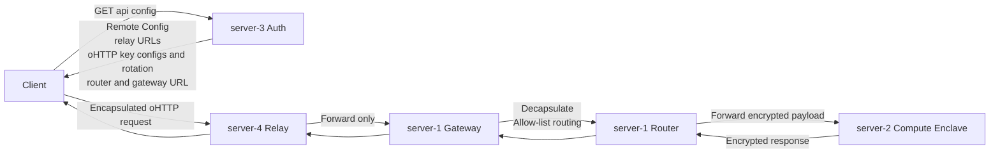
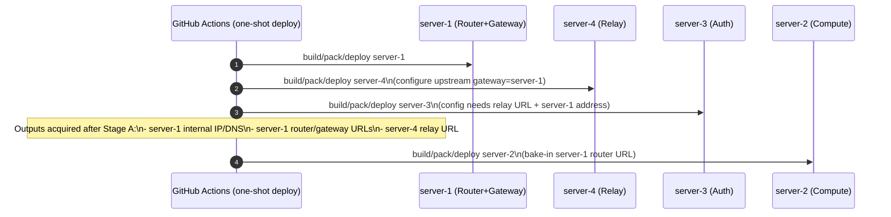

## 목적 (Objective)

OpenPCC 표준을 기반으로, v0.001 프로토타입 아키텍처를 v0.002로 확장한다. v0.002는 다음을 추가/개선한다.

- Real Attestation 지원을 위한 `server-3 (auth)` 추가
- oHTTP 지원을 위한 `server-4 (relay)` 추가 및 `server-1`의 `router + gateway` 역할 명시
- One-time deploy workflow 추가 (단, bootstrap 이슈 해결을 위해 순차 배포 허용)

본 문서는 구현 상세가 아니라 컴포넌트 책임 경계, 데이터 흐름, 배포/운영 원칙을 고정한다.

## 범위 (Scope)

- In scope
  - `server-1`: Router + oHTTP Gateway
  - `server-2`: Compute Node (Nitro Enclave 기반)
  - `server-3`: Auth (Remote Config 제공 + Real Attestation 지원)
  - `server-4`: oHTTP Relay (원칙은 제3자 운영, v0.002는 동일 운영자 배포)
  - `client`: CLI 중심 테스트/샘플 클라이언트(현재 리포에 존재)

- Out of scope (v0.002)
  - 결제/크레딧/BlindBank(OpenPCC의 BlindBank 포함 결제 플로우)은 요구사항에 없으므로 미구현 범위 밖으로 둔다.
  - 단, OpenPCC 용어 정합성을 위해 “AuthBank/BlindBank 개념”은 참조 가능하되, v0.002 구현 대상으로 간주하지 않는다.

## 컴포넌트 개요 (Components)

### `server-1` (Router + oHTTP Gateway)

- Router
  - Compute node registry / health / load balancing
  - 클라이언트 요청을 선택된 compute 노드로 forwarding
- oHTTP Gateway
  - oHTTP 요청을 디캡슐화(outer layer 제거)
  - allow-list된 내부 서비스로만 전달(보안 경계)
  - 디캡슐화 후의 내부 요청은 Router로 전달하는 것을 기본으로 한다
- v0.002 배치 원칙
  - Router와 Gateway는 동일 instance 내에서 **서로 독립적인 user process**로 동작한다
  - upstream(openpcc/openpcc) 구조 변경 없이 각 컴포넌트를 그대로 수용한다

### `server-2` (Compute Node)

- Nitro Enclave 내에서 추론 수행(요청 복호화 종단)
- Real Attestation evidence 생성/제공 (검증은 기본적으로 client 측에서 수행하는 것을 원칙으로 함)
- v0.002는 “Real Attestation을 사용할 수 있는 구조”를 명시하며, 구체 evidence 포맷/검증 정책은 구성(또는 향후 문서)로 분리 가능

### `server-3` (Auth)

- 클라이언트가 시스템에 접속하기 위한 control-plane 엔드포인트
- 역할
  - Remote Config 제공: relay URL 목록, oHTTP key config(+회전정보), router/gateway endpoint 등
  - Real Attestation 사용을 위한 정책/구성 제공(“무엇을 검증해야 하는가”)
- 비역할(명시)
  - v0.002에서는 결제/크레딧/BlindBank는 다루지 않는다

### `server-4` (oHTTP Relay)

- 역할
  - 제3자 운영이 이상적(표준 가정)
  - encrypted/encapsulated 요청을 gateway로 포워딩
- 비역할(명시)
  - oHTTP 키를 알 필요가 없다(키 없이도 포워딩 가능)
  - 요청 내용을 복호화하지 않는다

## 기본 포트 (v0.002 기본값)

- `server-1` Router: `3600`
- `server-1` Gateway: `3200`
- `server-4` Relay: `3100`

## 신뢰/위협 모델(요약) (Trust & Threat Model)

- 목표: 단일 컴포넌트가 사용자 식별자와 요청 내용을 동시에 확보하지 못하게 한다.
- Relay(`server-4`): 사용자의 네트워크 메타데이터(IP 등)는 볼 수 있으나, 요청 내용은 모른다.
- Gateway(`server-1`): 요청 내용을 디캡슐화하나, Relay를 통해 들어온 요청이므로 원칙적으로 사용자 식별 메타데이터는 최소화된다.
- Router(`server-1`): compute 선택 및 forwarding 수행, 사용자 신원 정보를 보유하지 않는다.
- Compute(`server-2`): 요청 내용을 복호화 가능한 종단(추론 수행), 사용자 신원 정보를 직접 받지 않는 구조를 유지한다.
- Auth(`server-3`): Remote Config/정책의 배포 지점이며, v0.002 범위에서 “결제/크레딧으로 신원 결합”은 하지 않는다.

## 데이터 플로우 1: Config 획득 + oHTTP 요청 경로

- 핵심 포인트
  - `server-3`는 client가 사용할 relay URL과 gateway 공개키 구성(oHTTP key config)을 제공한다.
  - `server-4`는 키를 몰라도 되고, 포워딩만 한다.
  - `server-1`은 gateway로서 디캡슐화 후 allow-list된 내부 라우팅만 수행하며, 그 다음 router가 compute로 forwarding 한다.
  - 이 레포의 CLI(client/cli/*)는 `server-3 /api/config`를 호출하지 않고,
    환경 변수/INI로 relay URL과 oHTTP seeds를 직접 주입하는 방식도 지원한다.

## oHTTP 키/회전 정책 (v0.002: 옵션 A, 향후 옵션 C 확장)

### v0.002 채택: 옵션 A — 공유 Seed 기반 결정적 키 생성

목표: `server-1(gateway)`와 `server-3(auth)`가 동일한 key material “정합성”을 갖도록, seed 기반으로 동일한 key config를 결정적으로 생성한다.

- 운영 개념
  - 보안 저장소(예: AWS Secrets Manager 등)에 다음을 저장한다.
    - `OHTTP_KEYS[]`:
      - `key_id` (byte/짧은 ID)
      - `seed_hex`
      - `active_from`
      - `active_until`
- 배포 시 동작
  - `server-1 (gateway)`:
    - seed로 keypair(private 포함)를 생성/로딩하여 디캡슐화에 사용한다.
  - `server-3 (auth)`:
    - 동일 seed로 public key config(+rotation periods)를 생성하여 `/api/config`에 포함한다.
- 회전 정책(최소)
  - 새 키는 `active_from = T + Δ`로 “미리 배포”한다.
  - 이전 키는 overlap 기간을 두고 `active_until`까지 유지한다.
  - gateway는 overlap 동안 구/신 키 모두를 수용한다.
  - client는 config 갱신 후 새 키를 우선 사용한다.

NOTE: v0.002 one-shot deploy는 oHTTP 키 동기화 입력을 **이미 전달/구성하도록 준비되어 있다**.
enable 조건 및 입력은 아래와 같다.

- enable 옵션: one-shot deploy에서 `enable_server3_ohttp_advertise=true`
- 필수 입력:
  - `OPENPCC_OHTTP_SEEDS_JSON` (seed 목록 JSON)
- 선택 입력:
  - `OPENPCC_OHTTP_SEEDS_SECRET_REF` (deploy 스크립트에서 JSON을 조회할 때만 사용)
- 동작:
  - `server-3`는 seeds JSON으로 public key config(+rotation)를 생성하여 `/api/config`에 포함한다.
  - `server-1` gateway는 `OHTTP_SEEDS_JSON` 환경변수만 읽는다.
    `OHTTP_SEEDS_SECRET_REF`는 `deploy_server1.sh`가 JSON을 조회해 주입할 때만 사용된다.

참고: one-shot deploy 워크플로는 `enable_server3_ohttp_advertise=true`일 때
`OPENPCC_OHTTP_SEEDS_JSON`이 반드시 존재하도록 사전 검증한다.

주의(명시): 옵션 A는 운영 단순성이 장점이지만, seed가 `server-3`에도 존재할 수 있어 권한 분리 관점이 약해질 수 있다. 따라서 장기적으로 옵션 C로 확장한다.

### 향후 확장: 옵션 C — 투명성(Transparency) 기반 키 번들 배포

목표: oHTTP key config(+rotation) 배포를 “감사 가능하고 검증 가능한 번들”로 강화한다.

- 키 config(+rotation periods)를 투명성(서명된 statement bundle)로 게시한다.
- `server-3`는 `/api/config`에서 해당 번들을 제공(또는 해시/URI 제공)한다.
- client는 번들을 검증하고, 검증된 키만 사용한다.

명시: v0.002는 옵션 A를 기본으로 하되, 외부 감사/표준 정합성 강화를 위해 옵션 C로 확장한다.

## Real Attestation (요약)

- 목표: fake/sim 기반 흐름을 넘어, 실제 attestation evidence를 이용한 검증 흐름을 추가한다.
- 원칙(구조)
  - Evidence 생성: `server-2 (compute)` 측
  - Evidence 검증: 기본적으로 `client` 측(또는 client에 포함된 검증 로직/라이브러리)
  - `server-3 (auth)`는 “검증 정책/구성”의 배포 지점으로 동작한다.
- 문서 최소 요구사항
  - client가 무엇(어떤 증거/측정값/정책 버전)을 검증해야 하는지와,
  - 그 정책이 어디서 오며(server-3), 어떤 방식으로 업데이트되는지(구성/릴리즈)를 명시한다.

## 운영 가정: Relay 제3자 운영 원칙 vs v0.002 현실

- 표준(OpenPCC) 가정: oHTTP Relay는 제3자 운영이 권장된다(상관관계/공모 위험을 분산).
- v0.002 현실: 현재 제3자 relay 운영자가 없어 `server-4`를 동일 운영자가 함께 배포한다.
- 영향
  - 동일 운영자 하에서는 relay와 gateway/router의 메타데이터 결합 위험이 증가할 수 있다.
- 최소 완화책(권장)
  - relay 로그 최소화 및 짧은 보존 기간
  - gateway/router에서 사용자 식별자(IP 등) 비저장 원칙
  - 향후 제3자 relay로 전환 계획 유지

## CI/CD 및 배포 (Workflows)

### 기본 원칙: One-shot deploy 단일 워크플로

- 기본 운영 모드는 build/pack/deploy를 **단일 워크플로**에서 수행한다.
- 분리 워크플로(`build-pack`, `deploy`)는 제거한다.
- 목적: 운영 단순화 및 bootstrap 입력 의존성(server-1 주소) 해소

### One-shot deploy 순차 배포 (v0.002 기본)

- 요구: 한 번에 build/pack/deploy를 수행한다(이미지를 따로 확보해 나중에 deploy하는 흐름은 요구하지 않음).
- 문제: server-1 주소가 deploy 단계에서 확정되며, server-4/3/2가 이를 설정에 포함해야 하는 bootstrap 이슈
- v0.002 설계: 순차 배포로 단순화
  - 먼저 `server-1`을 build/pack/deploy하여 gateway/router 주소를 확보
  - 이후 `server-4`를 build/pack/deploy하여 relay URL을 확보
  - 이후 확보한 relay URL과 server-1 주소로 `server-3`를 build/pack/deploy
  - 마지막으로 `server-2`를 build/pack/deploy (router URL을 입력으로 사용)

## 배포/CI 다이어그램 2: One-shot deploy 순차 배포

- 핵심: one-shot deploy에서는 “server-1 → server-4 → server-3 → server-2” 순서로 bootstrap 이슈를 우회한다.

## `server-3 /api/config` 최소 스키마 (제안)

v0.002 범위(결제/크레딧/BlindBank 제외)에서 client가 oHTTP 요청을 만들고 Real Attestation 검증 기준을 얻기 위해 필요한 최소 필드만 정의한다.

| 필드 | 타입(개념) | 의미 | 소스(누가 정함) | 사용처 |
|---|---|---|---|---|
| `version` | string | config 스키마/호환 버전(예: `0.002`) | `server-3`(릴리즈) | client 호환성/기능 분기 |
| `features.ohttp` | bool | oHTTP 사용 여부 | `server-3` | client 동작 분기 |
| `features.real_attestation` | bool | Real Attestation 사용 여부 | `server-3` | client 동작 분기 |
| `relay_urls[]` | list(string) | oHTTP relay endpoint 목록 | 운영 설정(현재는 `server-4`) | client oHTTP 요청 목적지 |
| `gateway_url` | string | oHTTP gateway(base URL) | 운영 설정(= `server-1`) | relay upstream/디버그/검증 |
| `router_url` | string | router endpoint 또는 표준 host 표기 | 운영 설정(= `server-1`) | 디캡슐화 후 라우팅 목적지 |
| `ohttp_key_configs_bundle` | bytes/base64 | gateway 공개키 구성(oHTTP key configs) 번들 | 옵션 A: 공유 seed 기반 생성 | client oHTTP 캡슐화 |
| `ohttp_key_rotation_periods` | json/list | key별 회전/유효기간(또는 힌트) | 옵션 A: seed 메타 기반 생성 | client 키 선택/캐시 |
| `attestation.policy_id` | string | 검증 정책 버전/ID | `server-3`(정책 릴리즈) | client 검증 기준 식별 |
| `attestation.allowed_*` | object | 허용 측정값/이미지/증거 제약(구현별) | `server-3` | client attestation 검증 |
| `attestation.verifier_hints` | object(선택) | 검증 모드/라이브러리 힌트 | `server-3` | client verifier 선택 |

옵션 C 확장 시 `ohttp_key_configs_bundle`은 “투명성 번들(또는 URI+해시)”로 강화되며, client는 해당 번들을 검증 후 키를 사용한다.

## One-time deploy: outputs/env 변수 (제안)

요구사항의 핵심은 “server-1 주소가 deploy에서 결정 → server-4/3/2가 그 값을 포함해야 함”이므로, one-shot deploy는 아래 값을 server-1 배포 결과로 추출해 후속 단계에 전달한다.

### Stage A(server-1 + server-4 + server-3 먼저 배포)에서 반드시 산출할 값

| 변수 | 예시 | 의미 | 생성 시점/소스 | Stage B 사용처 |
|---|---|---|---|---|
| `SERVER1_INTERNAL_ADDR` | `10.0.1.23` 또는 내부 DNS | server-1 내부 주소 | server-1 deploy 후 EC2 조회 | `server-2` router 주소 구성 |
| `SERVER1_ROUTER_URL` | `http://10.0.1.23:3600/` | router base URL | `SERVER1_INTERNAL_ADDR`로 조합 | `server-2` router 주소 입력 |
| `SERVER1_GATEWAY_URL` | `http://10.0.1.23:3200/` | relay upstream gateway URL | `SERVER1_INTERNAL_ADDR`로 조합 | `server-4` upstream |
| `SERVER4_RELAY_URL` | `http://<relay-ip>:3100/` | relay URL | server-4 deploy 후 계산 | `server-3` config |

### Stage B(server-2 배포)에서 입력으로 필요한 값

| 변수 | 의미 | 주입 대상 |
|---|---|---|
| `SERVER1_ROUTER_URL` | server-2가 참조할 router 주소 | `server-2` build/pack/deploy |
| `IMAGE_TAG` | 릴리즈 단위 동기화 | 공통 |

PoC 기준에서는 모든 서버가 동일 Subnet에 있다고 가정하고
`SERVER1_INTERNAL_ADDR`(private IP)를 사용하도록 허용한다.
이 가정은 임시이며, 다른 네트워크 구성에서는 별도 주소 입력이 필요하다.

## Known Issue & Future Work

- 현재 v0.002는 `server-1`과 `server-3` 간 직접 통신을 요구하지 않는다
  (server-3는 client에게 config를 제공하고, server-1은 이를 직접 pull하지 않는다).
- 향후 `server-1`이 `server-3`에서 oHTTP 키/구성 정보를 직접 조회하는 구조로
  변경될 수 있다. 이 경우 보안그룹/네트워크 규칙을 업데이트해
  `server-1 -> server-3 (TCP 8080)` 통신을 허용해야 하며,
  장애 시 캐시/폴백 전략도 문서화해야 한다.

## Known Issues (v0.002)

- `server-1`의 mem-gateway는 upstream(openpcc) `cmd/mem-gateway` 구현을 그대로 사용한다.
  - 해당 구현에는 `BankURL = "http://localhost:3500"` 하드코딩이 존재한다.
  - v0.002 범위에서는 credit/bank 플로우가 out of scope이므로 변경하지 않는다.
  - 향후 credit 관련 문제가 생기면 **gateway의 BankURL(3500)** 과
    **credithole 기본 포트(3501)** 정합 여부를 우선 확인한다.
- `server-4` relay는 인스턴스 생성 시 부여되는 public IP를 사용한다.
  - 고정된 relay URL이 필요하면 EIP/Route53 기반의 안정화가 필요하지만,
    v0.002에서는 자동화하지 않는다.

## 용어(Glossary)

- oHTTP Relay: 제3자가 운영하는 프록시, 사용자 식별 메타데이터는 볼 수 있으나 내용은 복호화 불가
- oHTTP Gateway: relay로부터 받은 oHTTP 메시지를 디캡슐화(outer layer 제거)하고 내부 서비스로 전달
- Router: compute 후보 선택 및 forwarding 담당
- Real Attestation: 실제 hardware/TEE 기반 attestation evidence를 통한 신뢰 검증 흐름

## 문서 유지 방침

- v0.002부터는 본 `ARCHITECTURE.md`가 단일 진실 공급원(SSOT)이다.
- 이전 버전(v0.001) 텍스트를 문서에 병기하지 않는다.
  - 이유: 다른 자동화 에이전트/개발자가 구버전 전제를 근거로 잘못된 행동을 하지 않도록 하기 위함.
