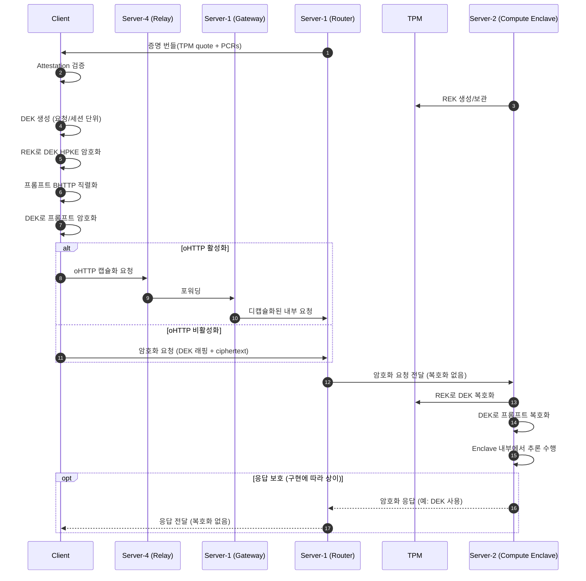

# OpenPCC에서 프라이버시가 보존되는 방식 (v0.002)

이 문서는 본 레포지토리의 설계 문서와 설정을 기준으로, 클라이언트 쿼리/응답이
어떻게 보호되는지 요약합니다.

## 범위 및 근거

이 레포에서 확인한 근거:
- ARCHITECTURE.md (주요 설계 설명)
- server-2/config/compute_boot.yaml
- server-2/config/router_com.yaml
- HOW-TO-DEPLOY.md
- system_test.sh (로컬 테스트 설정)

중요한 범위 참고:
- 이 레포에는 `client/cli/*` 형태의 CLI 클라이언트가 포함되어 있습니다.
  이 CLI는 환경 변수 또는 `/etc/nnstreamer/hybrid.ini` 설정으로 relay/seed를 받으며,
  `server-3 /api/config`를 직접 호출하지 않습니다.
- 프로덕션 SDK 동작은 upstream OpenPCC를 기준으로 합니다.

## 용어 요약

- REK: Compute enclave에서 생성되는 Request Encryption Key
  (비대칭키 쌍, 공개키는 증명 번들로 제공되고 개인키는 TPM에 상주)
- DEK: 클라이언트가 요청/세션 단위로 생성하는 Data Encryption Key
  (대칭키, 요청 페이로드 암호화에 사용)
- HPKE: REK 공개키로 DEK를 감싸는(암호화하는) 공개키 기반 암호 방식
- BHTTP: 요청 페이로드 인코딩에 사용하는 Binary HTTP
- Attestation: compute node 신뢰성 검증 절차
- TPM: 증명과 키 관리를 위한 보안 모듈
- Nitro Enclave: 격리된 추론 실행 환경

## 프라이버시 보존의 핵심 흐름

1) 클라이언트는 server-3(제어 플레인) 또는 로컬 CLI 설정으로 라우팅 구성을 얻고,
   Router로부터 ComputeNode의 증명 번들(TPM quote, PCR)을 수신한다.
   (증명 번들에는 REK 공개키가 포함되며, REK 개인키는 TPM에 유지됨)
2) 클라이언트는 증명(Attestation)을 검증한다.
3) 클라이언트가 쿼리를 암호화한다.
   - DEK 생성 (대칭키)
   - REK 공개키로 DEK를 HPKE 암호화
     (클라이언트는 공개키로 암호화, Compute는 개인키로 복호화)
   - 프롬프트를 BHTTP로 직렬화하고 DEK로 암호화
4) oHTTP가 활성화된 경우 Relay → Gateway → Router 경로를 통과한다.
   oHTTP가 비활성화된 경우 클라이언트가 Router로 직접 요청한다.
   Router는 복호화 없이 암호화된 요청을 전달한다.
5) Compute enclave가 TPM 내 REK 개인키로 DEK를 복호화하고,
   프롬프트를 복호화해 추론한다.

응답 보호에 대한 참고:
- 이 레포 문서에는 응답 암호화 포맷이 명시되어 있지 않습니다.
  따라서 응답 보호는 upstream OpenPCC/ConfidentCompute 구현 확인이 필요합니다.

## 다이어그램: 암호화/복호화/전송 흐름

## 설계 문서 기반 보안 속성

- 전송 구간 기밀성: Router는 DEK가 없고 복호화를 하지 않으므로 내용을 볼 수 없다.
- Compute 구간 기밀성: 복호화는 enclave 내부에서 TPM 키를 통해 수행된다.
- 증명 기반 신뢰: 클라이언트가 TPM quote/PCR을 검증한 후 요청을 전송한다.
- 하드닝: SELinux, dm-verity(읽기 전용 FS), SSH 차단 등을 적용하도록 설계됨.
- 네트워크 분리 권장: Compute는 Router 보안 그룹에서만 접근하도록 권장됨.

## 개발용 설정 주의

- 로컬 테스트에서는 TPM 시뮬레이터 및 fake attestation secret을 사용할 수 있다.
  (compute_boot.yaml, system_test.sh) 운영 환경에서는 사용 금지.

## 확인 필요 사항

- 응답 암호화 포맷/키 사용 방식은 이 레포에 명시되어 있지 않으므로,
  upstream OpenPCC/ConfidentCompute 구현 확인 후 문서 보강이 필요하다.
