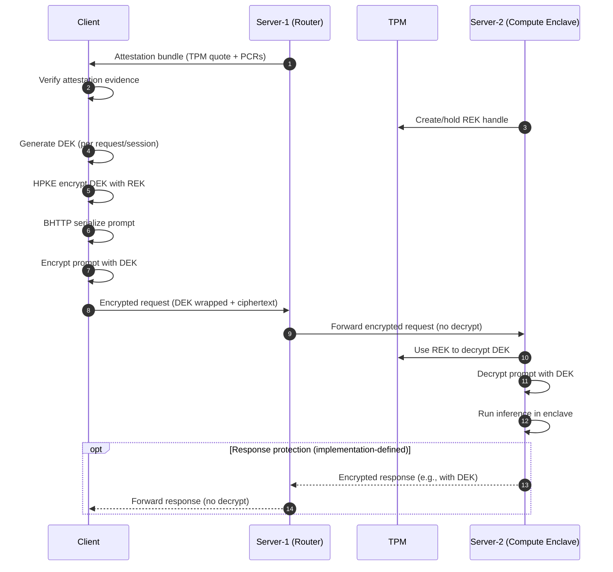

# How Privacy Is Preserved in OpenPCC (Prototype 1)

This document summarizes how client queries and answers are protected in the
OpenPCC prototype, based on the design notes and configuration in this repo.

## Scope and sources

Sources in this repository:
- ARCHITECTURE.md (primary design description)
- server-2/config/compute_boot.yaml
- server-2/config/router_com.yaml
- HOW-TO-DEPLOY.md
- system_test.sh (local test settings)

Important scope note:
- The client implementation is not included in this repo. The encryption flow
  below follows the design notes in ARCHITECTURE.md and upstream OpenPCC.

## Terms (short)

- REK: Request Encryption Key created in the compute enclave.
- DEK: Data Encryption Key generated by the client per request/session.
- HPKE: Public key encryption used to wrap the DEK with the REK.
- BHTTP: Binary HTTP encoding used for the request payload.
- Attestation: Verification that the compute node runs trusted code.
- TPM: Hardware security module used for attestation and key handling.
- Nitro Enclave: Isolated compute environment for inference.

## High-level privacy model

1) The client verifies the compute node attestation evidence (TPM quote, PCRs).
2) The client encrypts the query:
   - Generate a DEK.
   - Encrypt (wrap) the DEK with REK using HPKE.
   - Serialize the prompt as BHTTP and encrypt it using the DEK.
3) The router forwards the encrypted request without decrypting it.
4) The compute enclave uses TPM/REK to decrypt the DEK, then decrypts the prompt,
   runs inference, and prepares a response.

Note about responses:
- The repository documents request encryption explicitly, but does not specify
  the exact response encryption format. Response protection is therefore
  implementation-defined and must be confirmed in upstream OpenPCC/ConfidentCompute.

## Diagram: encryption, decryption, and transport flow

## Security properties (from design notes)

- Confidentiality in transit: the router cannot read the request content because
  it does not have the DEK and does not decrypt traffic.
- Confidentiality at compute: decryption happens inside the enclave using TPM-
  anchored keys; the host and router do not hold request plaintext keys.
- Attestation-based trust: the client validates TPM quote/PCRs before sending
  sensitive data, ensuring the compute node is a trusted build.
- Hardening: the compute image is expected to use SELinux, dm-verity (read-only
  filesystem), and disable remote access such as SSH (per ARCHITECTURE.md).
- Network segmentation: deployment guidance recommends restricting compute node
  access to only the router security group (HOW-TO-DEPLOY.md).

## Non-production settings and cautions

- Local testing can enable TPM simulators and fake attestation secrets
  (compute_boot.yaml, system_test.sh). These are for development only and should
  be disabled for production deployments.

## Gaps and verification steps

- Response encryption is not described in this repo. Confirm upstream behavior
  in OpenPCC/ConfidentCompute and document the exact response format and keys.
